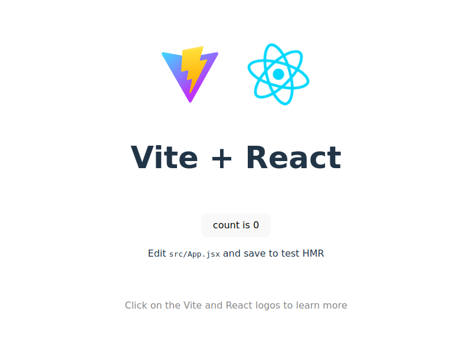

# Screenshot Pipeline 🌟

[](https://github.com/PasiduRanasinghe/Screenshot-Pipeline/actions)
[](https://opensource.org/licenses/MIT)

[](https://PasiduRanasinghe.github.io/Screenshot-Pipeline)

A modern Vite + React website with automated screenshot documentation. The repository automatically captures and updates the README preview image on every push to main.

## ✨ Features

- ⚡ Blazing-fast development with Vite
- 🚀 React 18 + TypeScript
- 🤖 Automated screenshot updates via GitHub Actions
- 📱 Responsive design
- 📦 Optimized production builds
- 🔄 CI/CD pipeline integration

## 🚀 Getting Started

### Prerequisites

- Node.js ≥ 18.x
- npm ≥ 9.x

### Installation

1. Clone the repository:
   ```bash
   git clone https://github.com/PasiduRanasinghe/Screenshot-Pipeline.git
   ```
2. Install dependencies:
   ```bash
   cd Screenshot-Pipeline && npm install
   ```

### Development

```bash
npm run dev    # Start development server
npm run build  # Create production build
npm run preview # Locally preview production build
```

## 🤖 Automation

This project automatically:
1. Captures website screenshots on push to `main`
2. Updates README.md with latest preview
3. Maintains documentation freshness

**Workflow File**: [screenshot-update.yml](.github/workflows/screenshot-update.yml)

## 📸 Live Preview

The screenshot above shows the latest production version. Click the image to visit the live site.

## 🌐 Deployment

Automatically deployed to GitHub Pages via GitHub Actions.
Production URL: [https://PasiduRanasinghe.github.io/Screenshot-Pipeline](https://PasiduRanasinghe.github.io/Screenshot-Pipeline)

## 🤝 Contributing

1. Fork the project
2. Create your feature branch (`git checkout -b feat/amazing-feature`)
3. Commit changes (`git commit -m 'Add amazing feature'`)
4. Push to branch (`git push origin feat/amazing-feature`)
5. Open a Pull Request

## 📄 License

Distributed under the MIT License. See [LICENSE](LICENSE) for details.